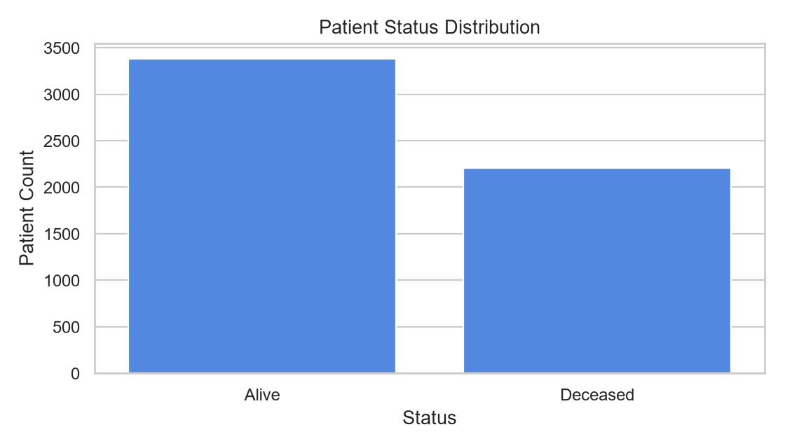
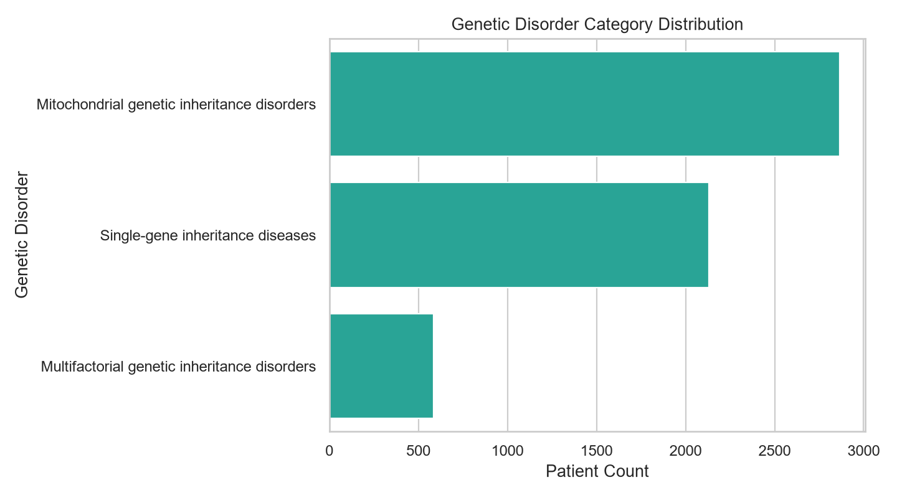
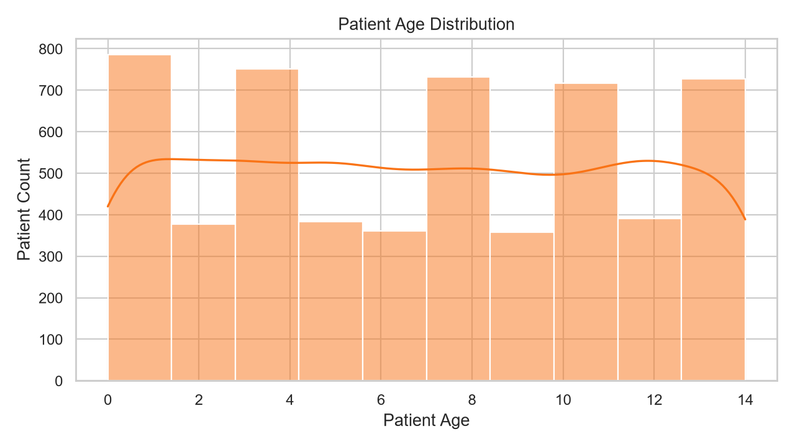

# Predictive Genetic Disorder Model

This repository contains a reproducible machine learning project for analyzing a clinical genetics dataset and training predictive classification models. The workflow cleans the data, removes direct identifiers, builds preprocessing pipelines, handles class imbalance, trains multiple supervised models, and saves the best-performing model and metrics locally.

The project compares:

- Support Vector Machine
- Random Forest Classifier
- Decision Tree Classifier

By default, the training script predicts patient `status`. The same workflow can also be pointed at another available target column, such as `genetic_disorder`.

## Access The Code

- Original notebook: [notebooks/Final_Project_Genetic_Disorder_task_1.ipynb](notebooks/Final_Project_Genetic_Disorder_task_1.ipynb)
- Data cleaning module: [src/genetic_disorder_ml/data.py](src/genetic_disorder_ml/data.py)
- Model training module: [src/genetic_disorder_ml/train.py](src/genetic_disorder_ml/train.py)
- Training script: [scripts/train_model.py](scripts/train_model.py)
- Full project write-up: [PROJECT_WRITEUP.md](PROJECT_WRITEUP.md)

## Visualizations

The raw patient-level dataset is not published, but the repository includes aggregate visualizations:







## Model Results

### Patient Status Prediction

Test set size: `1,397` patients

| Model | Accuracy | Correct Predictions | Wrong Predictions | Weighted F1 |
|---|---:|---:|---:|---:|
| Support Vector Machine | 91.84% | 1,283 / 1,397 | 114 / 1,397 | 91.88% |
| Random Forest | 100.00% | 1,397 / 1,397 | 0 / 1,397 | 100.00% |
| Decision Tree | 100.00% | 1,397 / 1,397 | 0 / 1,397 | 100.00% |

Confusion matrix label order: `Alive`, `Deceased`

```text
Support Vector Machine
[[771,  75],
 [ 39, 512]]

Random Forest
[[846,   0],
 [  0, 551]]

Decision Tree
[[846,   0],
 [  0, 551]]
```

### Genetic Disorder Type Prediction

Test set size: `1,397` patients

| Model | Accuracy | Correct Predictions | Wrong Predictions | Weighted F1 |
|---|---:|---:|---:|---:|
| Support Vector Machine | 47.03% | 657 / 1,397 | 740 / 1,397 | 47.03% |
| Random Forest | 48.75% | 681 / 1,397 | 716 / 1,397 | 48.74% |
| Decision Tree | 47.03% | 657 / 1,397 | 740 / 1,397 | 47.87% |

The best model for genetic disorder type was Random Forest, correctly classifying `681` of `1,397` test cases.

## False Positives And False Negatives

For patient-status prediction, false negatives are especially important because they represent patients who were actually `Deceased` but predicted as `Alive`. In the SVM model, this happened in `39` cases. In a healthcare workflow, this kind of error could reduce urgency for patients who may need closer review.

False positives are also important because they represent patients who were actually `Alive` but predicted as `Deceased`. In the SVM model, this happened in `75` cases. This could lead to unnecessary concern, additional review, or inefficient use of clinical resources.

For genetic-disorder type prediction, false positives and false negatives mean the model assigned patients to the wrong disorder category. This matters because different genetic disorder groups may require different follow-up, counseling, monitoring, or specialist review. The disorder-type model had moderate performance, so it should be treated as an exploratory baseline rather than a clinical decision tool.

## Health Impact

Genetic disorder prediction models can support earlier identification of high-risk patient patterns, help health teams prioritize follow-up, and improve the way clinical data is organized for review. In a real healthcare setting, a validated model like this could help flag cases for genetic counseling, additional screening, or closer clinical monitoring.

This project is educational and should not be used for clinical diagnosis, treatment, or medical decision-making. Any real-world use would require clinical validation, bias testing, privacy review, model monitoring, and approval by qualified healthcare professionals.

## Project Structure

```text
data/
  raw/
    .gitkeep
notebooks/
  Final_Project_Genetic_Disorder_task_1.ipynb
src/
  genetic_disorder_ml/
    __init__.py
    data.py
    train.py
scripts/
  train_model.py
models/
reports/
  figures/
    genetic_disorder_distribution.png
    patient_age_distribution.png
    patient_status_distribution.png
requirements.txt
README.md
PROJECT_WRITEUP.md
```

## Setup

```powershell
python -m venv .venv
.venv\Scripts\Activate.ps1
pip install -r requirements.txt
```

## Dataset

The raw dataset is not committed because it can contain sensitive patient-level attributes and identifiers. To run the project locally, place your authorized copy at:

```text
data/raw/Genetic_disorder.csv
```

## Train Models

Run the default experiment:

```powershell
python scripts/train_model.py
```

Train a specific target:

```powershell
python scripts/train_model.py --target genetic_disorder
```

Outputs are written locally to:

- `models/best_model.joblib`
- `reports/metrics.json`

These generated files are ignored by Git.
